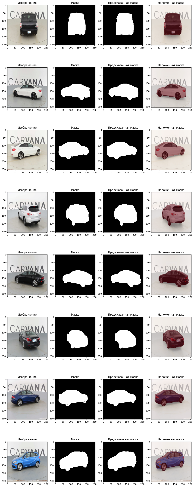

<h1>Немного теории </h1>
 Классификация vs. детекция vs. сегментация:

* Классификация - присвоение метки всему изображению
* Детекция - локализация объектов с bounding boxes
* Сегментация - пиксельная классификация (определение точных границ объектов): семантическая (различает классы) vs. instance (различает объекты в классе). Семантическая сегментация фокусируется на присвоении каждому пикселю класса, игнорируя инстансы.

 Архитектура UNET: Encoder-decoder структура с skip-connections для сохранения пространственной информации. Encoder (downsampling) извлекает признаки, decoder (upsampling) восстанавливает разрешение.

Сомнительно, что я напишу что то полезное поэтому
полезные сайты:

* https://deepmachinelearning.ru/docs/Neural-networks/Semantic-segmentation/U-net-and-extensions
* https://deepmachinelearning.ru/docs/Neural-networks/Semantic-segmentation/Upsampling-operations
* https://codeby.school/blog/informacionnaya-bezopasnost/primenenie-neyronnoy-seti-na-osnove-arhitektury-u-net-s-celyu-detektirovaniya-iskomyh-obektov-na-izobragheniyah-na-primere-detektirovaniya-aktivnyh-elementov-na-fotografiyah-pechatnyh-plat

 Картинки с наложением предсказанных масок (использовалась реализованная Unet):

 Для проведения эксперимента создан отдельный файл lab2.py. Просто чтобы быстрее провести эксперимент. Баг в том, что при num_workers > 0, программа лочится. Идея проблемы в том, что pytorch использует multiprocessing для workers, но Windows не допускает это без специальной защиты (нужно обернуть код в if __name__ == "__main__":)

num_workers -- это количество паралельных процессов для загрузки данных
 Результат эксперимента с разными размерами входного изображения:

| Размер  | Время GPU(с) | IoU | Dice | 
|---------|-----------|-------|-------|
|128|191|0.9591|0.9791|
|256|423|0.9767|0.9882|
|512|7292|0.9831|0.9915|

 Ответы на вопросы:

1. Почему accuracy плохо отражает качество сегментации?
- Дизбаланс классов (много фона, мало объекта), поэтому может быть большая Accuracy только изза предсказания фона.
- Accuracy не чуствительная к качесву границ, что в каких то задачах важно.
2. Чем UNet отличается от "обычной" CNN?
- U-образная структура (энкодер, центральный элемент, декодер) + есть skip-connections между слоями энкодера и декодера.